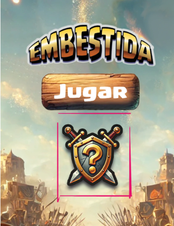
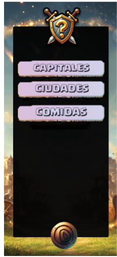
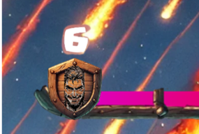

  
  

# Examen DI - Eval 1 - 24/10/2024

- [Descripción del examen](#descripción-del-examen)
  - [Embestida](#embestida)
  - [Estructura del proyecto](#estructura-del-proyecto)
- [Ejercicios](#ejercicios)
    - [Configura y comparte](#configura-y-comparte)
        - [Evaluación](#evaluación)
    - [Sustentar el trabajo](#sustentar-el-trabajo)
        - [Evaluación](#evaluación-1)
    - [La furia de la embestida](#la-furia-de-la-embestida)
        - [Evaluación](#evaluación-2)

# Descripción del examen

:grey_exclamation: El objetivo de esta prueba es evaluar la habilidad en el desarrollo de interfaces para Android, concetamente, usando kotlin y la librería de jetpack Compose.

Los contenidos de este examen incluyen:
- Desarrollo de vistas en jetpack compose
- Uso de intents
- Navegación entre componentes

---
#### Embestida

El proyecto de esta prueba se llama **estampida** es un juego de preguntas. Está compuesto por dos vistas: **el menú principal** y la vista de **juego**.
- Menu principal: Incluye un botón central que lleva al juego.
- Juego: El juego incluye más elementos que la vista principal, la sección de pregunta y respuestas, un termporizador de pregunta, un contador de racha y un botón de salir.

El juego es sencillo, las preguntas surjen infinitamente y el juador va ganando puntos si acierta y perdiendolos si falla.

  

---

#### Estructura del proyecto

  

---

- `MainActivity.kt`: Fichero principal de la Activity. No deberías hacer cambios aquí.
- `HomeScreen.kt` : Vista del menu.
- `AppNavigation.kt` : Fichero con un composable para la navegación.
- `GameViewModel.kt`: View Model del juego. Aquí se gestionan los cambios del modelo del juego.
- `GameScreen.kt`: Vista del juego.
- `SoundController.kt`: Incluye funcionas para reproducir sonidos. No deberías hacer cambios aquí.
- `Splash.kt` : Incluye funciones para gestionar la animación de entrada. No deberías hacer cambios aquí.

---

# Ejercicios

### Configura y comparte

El equipo de marketing ha pensado que nos ayudaría a expandirnos crear un punto de menu que permita compartir el enlace de la aplicación a los usuarios y así aumentar nuestro alcance. Para ello se ha pensado crear un pequño menu desplegable que incluya tambien una entrada para configuración.

**Tu tarea es implementar el menu y el intent de compartir.**

  
    

#### Evaluación
1. Se ha implementado el botón de desplegar el menú.
2. El boton de desplagar/plegar cambia de la letra + a la X según el estado.
3. El botón de desplegar es funcional
4. Se ha usado el tipo de letra `youblockheadopen.ttf`
5. El botón de plegar es funcional
6. Se ha agregado el boton no funcional de configuración.
6. Se ha agregado el boton de compartir.
7. Compartir redirigirá a `https://elearning5.hezkuntza.net/`
8. Se ha utilizado `tablero_octogonal.webp` como imagen de los botones.

---

###  Sustentar el trabajo

El equipo de monetización ha dicho que necesitamos cash flow urgente para mantener la empresa a flote, por eso, ha planteado la creación de distintos paquetes de preguntas que puedan vender. El equipo de diseño ha decidido adelantarse y hacer un prototipo no funcional de "como se vería" esa lista de temas en el juego.

**Tu tarea es implementar una vista de una lista de elementos accesible desde el menu principal.**

Aquí tienes el diseño de la página a crear y el del punto de menú.

  
    

#### Evaluación

1. Se ha creado un nuevo fichero de kotlin para la vista.
2. Se ha añadido un nuevo punto de menú a la vista
3. El punto de menu respeta el diseño.
4. El punto de menu es funcional y dirige a la vista.
5. El punto de menu usa el logo `logo.webp`.
6. La lista de elementos son botones no funcionales.
7. Se ha incluido un botón de volver atrás.
8. El punto de menú usa el botón `boton.webp`.
9. La vista de elementos se hace con LazyColum y con identificador.

---

### La furia de la embestida
Inicialmente, el desarrollador de la empresa pensó en un usar un contador de racha que se pusiera a 0 al fallar una pregunta. Más tarde, la idea de transformar el contador de rachas en uno de furia le pareció más atractiva... pero no ha cambiado el nombre de la variable en el código, que sigue llamandose racha. Ahora, queremos tener ambos contadores!

**Tu tarea es arreglar ese fallo y añadir el nuevo y deseado contador.**

Aquí tienes el diseño del contador:

#### Evaluación
1. Se ha cambiado el nombre de la variables que guardan la racha por furia en el `GameViewModel` y el `GameScreen` para que represente el estado real.
2. Se ha creado una nueva variable racha en el view vodel.
3. Se ha implementado correctamente la lógica necesaria para represente la racha de preguntas acertadas seguidas.
4. Se ha añadido la racha a la vista de juego, en la función `ProgressArea` en el `Thumb` del slider.
5. El contador de racha respeta el diseño.
