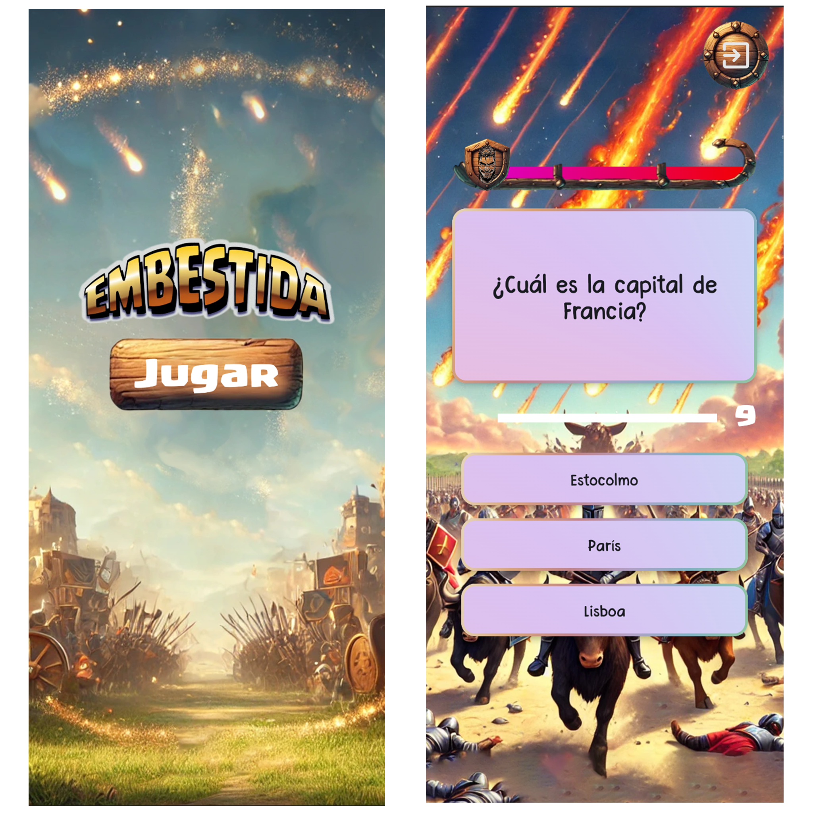
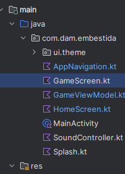
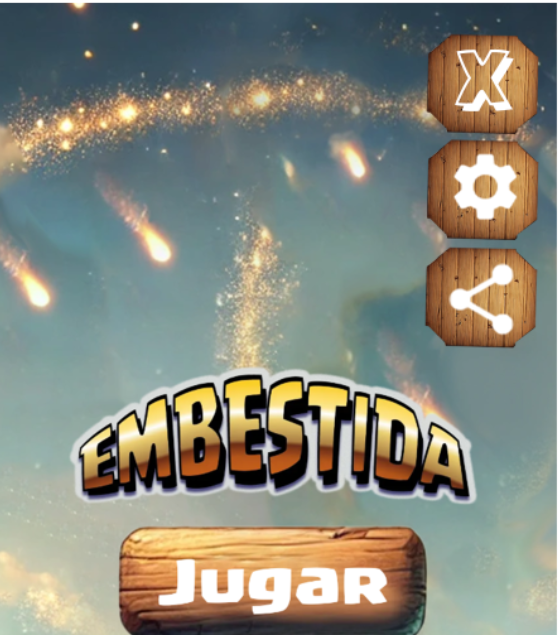
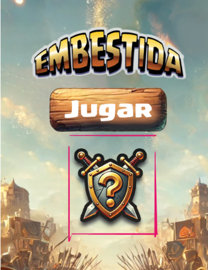
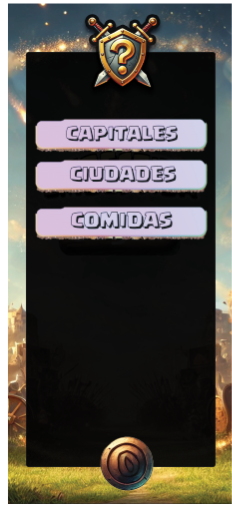
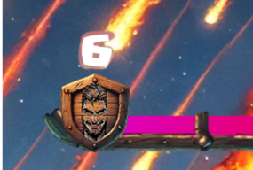

  
  

# Examen DI - Eval 1 - 24/10/2024

- [Examen DI - Eval 1 - 24/10/2024](#examen-di---eval-1---24102024)
- [Descripción del examen](#descripción-del-examen)
      - [Embestida](#embestida)
      - [Estructura del proyecto](#estructura-del-proyecto)
- [Ejercicios](#ejercicios)
    - [Configura y comparte (2,5p)](#configura-y-comparte-25p)
      - [Evaluación](#evaluación)
    - [Sustentar el trabajo (5p)](#sustentar-el-trabajo-5p)
      - [Evaluación](#evaluación-1)
    - [La racha de la embestida (2,5p)](#la-racha-de-la-embestida-25p)
      - [Evaluación](#evaluación-2)

# Descripción del examen

:grey_exclamation: El objetivo de esta prueba es evaluar la habilidad en el desarrollo de interfaces para Android, concretamente, usando kotlin y la librería de jetpack Compose.

Los contenidos de este examen incluyen:
- Desarrollo de vistas en jetpack compose
- Uso de intents
- Navegación entre componentes

---
#### Embestida

Este proyecto se llama **Embestida** y es un juego de preguntas. Está compuesto por dos vistas: la **vista de home** y la **vista de juego**.
- **Vista de home**: Incluye un botón central que lleva al juego.
- **Vista de Juego**: Incluye la sección de preguntas y respuestas, un temporizador de respuesta, un slider de furia y un botón de salir.

El juego es sencillo, las preguntas surgen infinitamente y el jugador va ganando furia si acierta y perdiendola si falla.

  

---

#### Estructura del proyecto

  

---

- `MainActivity.kt`: Fichero principal de la Activity. No deberías hacer cambios aquí.
- `HomeScreen.kt` : Vista del menu.
- `AppNavigation.kt` : Fichero con un composable para la navegación.
- `GameViewModel.kt`: View Model del juego. Aquí se gestionan los cambios del modelo del juego.
- `GameScreen.kt`: Vista del juego.
- `SoundController.kt`: Incluye funciones para reproducir sonidos. No deberías hacer cambios aquí.
- `Splash.kt` : Incluye funciones para gestionar la animación de entrada. No deberías hacer cambios aquí.

---

# Ejercicios

⚠️⚠️⚠️ Incluye un GIF mostrando cada ejercicio implementado en su sección correspondiente del README de este repositorio ⚠️⚠️⚠️

### Configura y comparte (2,5p)

El equipo de marketing ha pensado que ayudaría a expandirnos, crear un punto de menu que permita compartir el enlace de la aplicación a los usuarios y así aumentar nuestro alcance. Para ello se ha pensado crear un pequeño menu desplegable que incluya también una entrada para configuración.

**Tu tarea es implementar el menú y el intent de compartir.**

  
    

#### Evaluación
1. Se ha implementado el botón de desplegar el menú. (0.2p)
2. El boton de desplegar/plegar cambia de la letra + a la X según el estado. (0.5p)
3. El botón de desplegar es funcional. (0.2p)
4. Se ha usado el tipo de letra `youblockheadopen.ttf. (0.1p)
5. El botón de plegar es funcional. (0.2p)
6. Se ha agregado el boton no funcional de configuración. (0.2p)
6. Se ha agregado el boton de compartir. (0.2p)
7. Compartir redirigirá a `https://elearning5.hezkuntza.net/`. (0.5p)
8. Se ha utilizado `tablero_octogonal.webp` como imagen de los botones. (0.1p)
9. El código está bien estructurado y funciona sin errores. (0.3p)

---

###  Sustentar el trabajo (5p)

El equipo de monetización ha dicho que necesitamos cash flow urgente para mantener la empresa a flote, por eso, ha planteado la creación de distintos paquetes de preguntas que puedan vender. El equipo de diseño ha decidido adelantarse y hacer un prototipo no funcional de "como se vería" esa lista de temas en el juego.

**Tu tarea es implementar una vista de una lista de elementos accesible desde el menu principal.**

Aquí tienes el diseño de la página a crear y el del punto de menú.

  
    

#### Evaluación

1. Se ha creado un nuevo fichero de kotlin para la vista. (0.2p)
2. Se ha añadido un nuevo punto de menú a la vista (0.5p)
3. El punto de menú es funcional y dirige a la vista. (0.5p)
4. El punto de menú usa el logo `logo.webp`. (0.2p)
5. La lista de elementos son botones no funcionales. (0.5p)
6. Se ha incluido un botón de volver atrás. (0.7p)
7. El punto de menú usa el botón `boton.webp`. (0.2p)
8. La vista de elementos se hace con LazyColum y con identificador. (0.8p)
9. Se ha usado el tipo de letra `youblockheadopen.ttf`. (0.2p)
10. La página respeta el estilo del diseño. (0.9p)
11. El código está bien estructurado y funciona sin errores. (0.3p)

---

### La racha de la embestida (2,5p)
En el juego hay un slider con un escudo que va subiendo segun se aciertan preguntas. Ahora, además, queremos implementar un contador que indica la racha de preguntas acertadas seguidas.

**Tu tarea es agregar el contador de racha.**

Aquí tienes el diseño del contador:

#### Evaluación
1. Se ha creado una nueva variable racha en el view vodel. (0.4p)
2. Se ha implementado correctamente la lógica necesaria para que represente la racha de preguntas acertadas seguidas. (0.8p)
3. Se ha añadido la racha a la vista de juego, en la función `ProgressArea` en el `Thumb` del slider. (0.8p)
4. El contador de racha respeta el diseño. (0.2p)
5. El código está bien estructurado y funciona sin errores. (0.3p)
